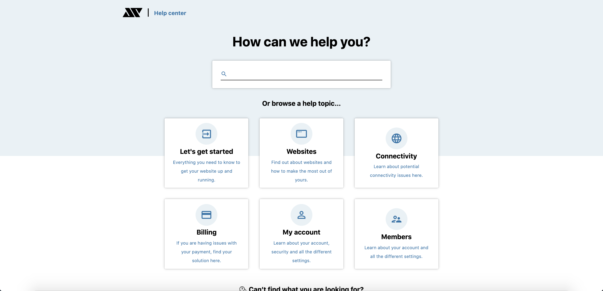

<!-- AUTO-GENERATED-CONTENT:START (STARTER) -->
<p align="center">
  <a href="https://www.gatsbyjs.org">
   
  </a>
</p>
<h1 align="center">
  gatsby-starter-baysik-documentation
</h1>

<h4 align="center">A starter for creating documentation / help sites using Gatsby.</h4>



## Quick Start

#### Create a Gatsby site

Use the Gatsby CLI to create a new site, specifying the Baysik starter.

```sh
# Create a new Gatsby site using the Baysik starter
gatsby new baysik-documentation https://github.com/adamistheanswer/gatsby-starter-baysik-documentation
```

[Official Gatsby Starter Page](https://www.gatsbyjs.org/starters/adamistheanswer/gatsby-starter-baysik-documentation/)

#### Start Developing

Navigate into your new site’s directory and start it up.

```sh
cd baysik-documentation
gatsby develop
```

#### Open the source code and start editing!

Your site is now running at `http://localhost:8000`!

Note: You'll also see a second link: `http://localhost:8000/___graphql`. This is a tool you can use to experiment with querying your data. Learn more about using this tool in the [Gatsby tutorial](https://www.gatsbyjs.org/tutorial/part-five/#introducing-graphiql).

## Changelog

All notable changes to this project will be documented in this file.

## [1.0.0] - 2020-11-07

### Added

- Lunr Local Search
